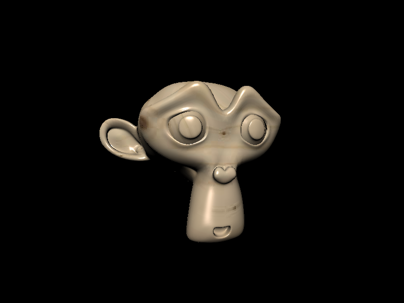
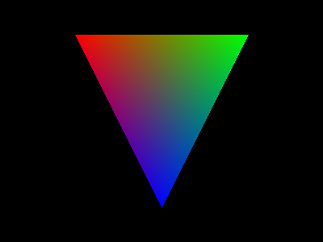

# Suzanne 🐒 - Depedency-free 3D Software Renderer



## Features 🐵

    - Programmable Vertex and Fragment shaders
    - Perspective correct varying interpolation
    - Texture mapping
    - OBJ model loader
    - API similar to OpenGL 2.0
    - Works in the browser and node.js

## Use cases 🙈

    - Server-side 3D rendering
    - Set your CPU on 🔥

## Todo 🙊

    - Support .mtl files
    - Improve performance

# Usage 🍌

```bash
npm install suzanne
```

## Importing

### Node.js

```javascript
const suzanne = require('suzanne');
```

### Browser

```html
<script src='./dist/suzanne.js'></script>
```

### Basic example

To draw something, a Canvas3D must be created

Suzanne internally stores pixel data in a Uint8ClampedArray in RGBA

```javascript
// Canvas3D's constructor expects a RenderingTarget which handles the pixel data

const cnv = new suzanne.Canvas3D(800, 600, {
    draw: bitmap => {
        // draw bitmap (to a file or in an html canvas)
    }
});

const triangle = {
    vertices: [
        suzanne.vec3(-1, -1, 3),
        suzanne.vec3(1, -1, 3),
        suzanne.vec3(0, 1, 3)
    ],
    indices: new Uint8Array([0, 1, 2]),
    attributes: {
        color: [
            suzanne.colors.red,
            suzanne.colors.green,
            suzanne.colors.blue
        ]
    }
};

// create a Vertex Array Object from our triangle
const VAO = suzanne.VertexArray.fromModel(triangle);

// Use a perspective projection matrix to transform the triangle's vertices
const proj = suzanne.Matrix4.perspective(suzanne.radians(70), cnv.width / cnv.height, 0.1, 1000);

// declare a uniform variable (accessible from both shaders)
VAO.setUniform('mvp', proj);

// Attach shaders to our Canvas3D
cnv.useProgram({
    // this function is executed for each vertex
    vertex_shader: vertex => {
        // interpolate the color attribute
        vertex.varyings.color = vertex.attributes.color;

        // return our transformed vertex's position
        return vertex.uniforms.mvp.transform(vertex.position);
    },
    // executed for each rasterized fragment
    fragment_shader: (varyings, uniforms) => {

        
        return varyings.color;
    }
});

// bind our VAO to our Canvas3D
cnv.bindVertexArray(VAO);

// clear the canvas to black
cnv.clear(suzanne.vec4(0, 0, 0, 1));

// draw the triangle in indexed mode
cnv.drawElements(suzanne.DrawingMode.TRIANGLES, 0, triangle.indices.length, 0);

// update the canvas
cnv.draw();
```

### Result

